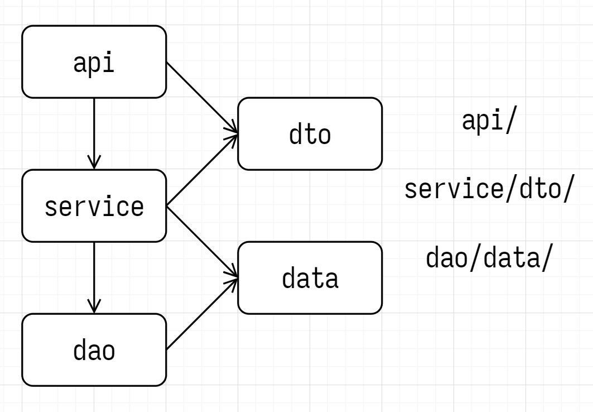

# gin-gorm

1. 读取 JSON, TOML, YAML 格式的配置文件 [viper](https://github.com/spf13/viper)
2. 日志框架 [zap](https://github.com/uber-go/zap)
3. HTTP 框架 [gin](https://github.com/gin-gonic/gin)
4. ORM 框架和 MySQL 驱动 [gorm](https://github.com/go-gorm/gorm)
5. Go 的 Redis 客户端 [go-redis](https://github.com/redis/go-redis)
6. JSON Web Tokens 的 Go 实现 [jwt-go](https://github.com/golang-jwt/jwt)

## 三层架构

- API
- Service
- DAO

