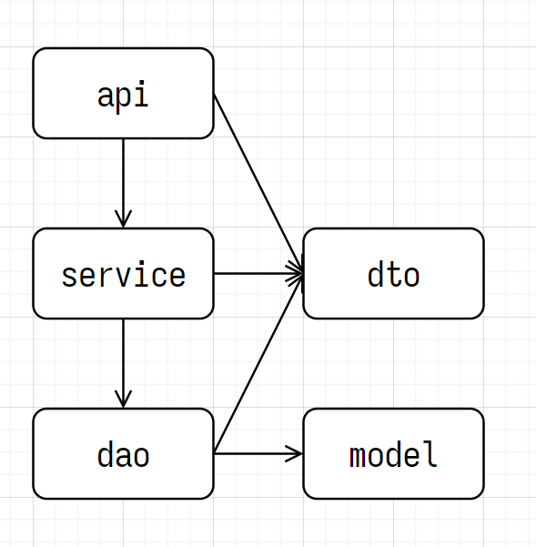

# gin-gorm

1. 读取 json, toml, yaml 格式的配置文件 [viper](https://github.com/spf13/viper)
2. 日志框架 [zap](https://github.com/uber-go/zap)
3. http 框架 [gin](https://github.com/gin-gonic/gin)
4. orm 框架和 mysql 驱动 [gorm](https://github.com/go-gorm/gorm)
5. go 的 redis 客户端 [go-redis](https://github.com/redis/go-redis)
6. jwt, json web tokens 的 go 实现 [golang-jwt](https://github.com/golang-jwt/jwt)
7. gin 跨域中间件 [cors](https://github.com/gin-contrib/cors)

## 三层架构

避免循环依赖 (import cycle not allowed)


### api 层

```go
type UserApi struct {
	UserService *service.UserService //! 组合 UserService
}

// ! UserApi 单例
var userApi *UserApi

func NewUserApi() *UserApi {
	if userApi == nil {
		userApi = &UserApi{
			UserService: service.NewUserService(),
		}
	}
	return userApi
}
```

### service 层

```go
type UserService struct {
	UserDao *dao.UserDao //! 组合 UserDao
}

// ! UserService 单例
var userService *UserService

func NewUserService() *UserService {
	if userService == nil {
		userService = &UserService{
			UserDao: dao.NewUserDao(),
		}
	}
	return userService
}
```

### dao 层

```go
type UserDao struct {
	database *gorm.DB
}

// ! UserDao 单例
var userDao *UserDao

func NewUserDao() *UserDao {
	if userDao == nil {
		userDao = &UserDao{
			database: global.Database,
		}
	}
	return userDao
}
```
