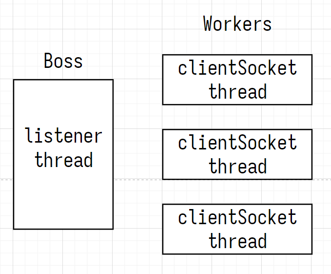

## BIO, NIO, AIO

| BIO, NIO, AIO |                 |           |
| ------------- | --------------- | --------- |
| BIO           | Blocking IO     | 阻塞 IO   |
| NIO           | Non-blocking IO | 非阻塞 IO |
| AIO           | Asynchronous IO | 异步 IO   |

## 阻塞 IO

- 如果未收到客户端的连接请求，线程阻塞在 accept，不能 read
- 如果套接字中没有数据，线程阻塞在 read，不能 accept

## 非阻塞 IO

- 非阻塞 listener: 如果未收到客户端的连接请求，accept 方法返回 null，线程继续运行
- 非阻塞 clientSocket: 如果套接字中没有数据，read 方法返回 0，线程继续运行

## selector IO 多路复用

事件的 4 种类型

- accept: 服务器收到客户端的连接请求时，服务器触发 accept 事件
- connect: 客户端与服务器建立连接时，客户端触发 connect 事件
- readable/writable: 套接字 可读/可写 事件

## 处理消息 message 的边界

- 缓冲区 ByteBuffer 大小 < 消息 message 长度 ==> 缓冲区扩容
- 缓冲区 ByteBuffer 大小 > 消息 message 长度 ==> 可能粘包、半包
- HTTP 1.1 TLV 格式：Type 类型、Length 长度、Value 数据
- HTTP 2.0 LTV 格式：Length 长度、Type 类型、Value 数据

## 多线程服务器

