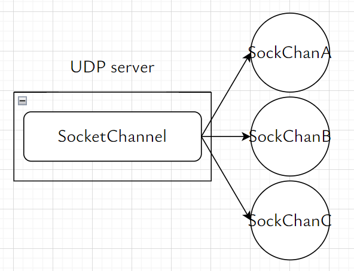

# ch04 使用 TCP 的服务器/客户端

服务器向 3 个客户端提供服务

- TCP 中，服务器需要 1 个用于 guardian 的服务器套接字 ServerSocket 和 3 个 用于 TCP 连接的套接字 Socket
- UDP 中，服务器只需要 1 个套接字 Socket




## 使用 TCP 的服务器/客户端

服务器

```c++
socket();        // 创建 ServerSocket 套接字
bind();          // 绑定 IP 地址、端口，成功时返回 0，失败时返回 -1
listen();        // 监听客户端的连接请求
accept();        // 接受客户端的连接请求，创建 Socket 套接字，服务器与客户端建立连接
read(); write(); // 数据交换
close();         // 断开连接
```

调用 listen 函数，监听客户端的连接请求

```c++
#include <sys/socket.h>
/**
 * @param serverSocketFd 服务器套接字文件描述符
 * @param maxConn 连接请求等待队列的容量 capacity
 * @return 成功时返回 0，失败时返回 -1
 */
int listen(int serverSocketFd, int maxConn);


```

服务器调用 accept 函数，接受客户端的连接请求

```c++
#include <sys/socket.h>
/**
 * @param serverSocketFd 服务器套接字文件描述符
 * @param clientAddr 客户端 IP 地址
 * @param clientAddrLen 客户端 IP 地址长度
 * @return 成功时返回套接字文件描述符，失败时返回 -1
 */
int accept(int serverSocketFd, sockaddr *clientAddr, socklen_t *clientAddrLen);

// 调用 accept 函数
sockaddr_in clientAddr{};
socklen_t clientAddrLen = sizeof(clientAddr);
int clientSocketFd = accept(serverSocketFd, (sockaddr *) &clientAddr, &clientAddrLen);
```

客户端调用 connect 函数，向服务器发送连接请求

```c++
#include <sys/socket.h>
/**
 * @param clientSocketFd 客户端套接字文件描述符
 * @param serverAddr 服务器 IP 地址
 * @param serverAddrLen 服务器 IP 地址长度
 * @return 成功时返回 0，失败时返回 -1
 */
int connect(int clientSocketFd, struct *serverAddr, socklen_t serverAddrLen);

// 调用 connect 函数
sockaddr_in serverAddr{};
serverAddr.sin_family = AF_INET; // IPv4 地址族
serverAddr.sin_addr.s_addr = inet_addr("127.0.0.1"); // 服务器 IP 地址
serverAddr.sin_port = htons(3333); // 服务器端口
connect(clientSocketFd, (sockaddr *) &serverAddr, sizeof(serverAddr))
```

## 回声服务器 echo server/client

[echo_server](./echo_server.cc)
[echo_client](./echo_client.cc)

```shell
cd build
./ch04_echo_server 3333
./ch04_echo_client 127.0.0.1 3333

cd build/go
./ch04_echo_server :3333
./ch04_echo_client 127.0.0.1:3333
```

未考虑粘包、半包问题
