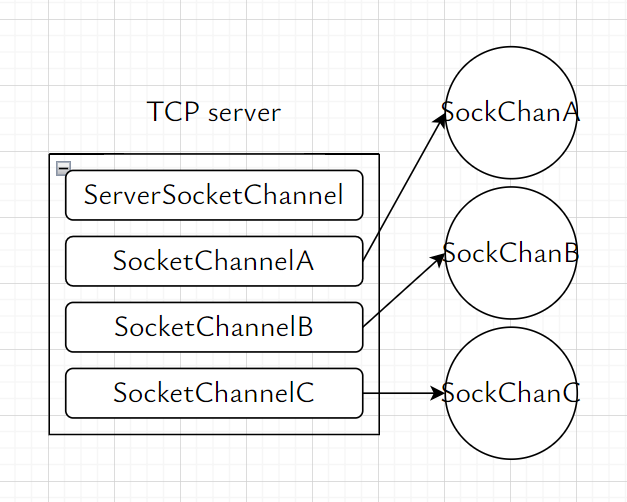
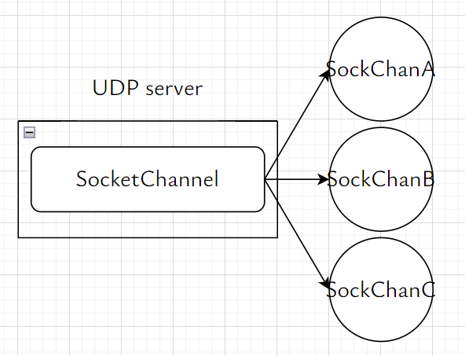

# ch06 使用 UDP 的服务器/客户端

## cc

服务器向 3 个客户端提供服务

- TCP 中，服务器需要
  - 1 个用于**监听**的服务器套接字 serverSocket
  - 3 个用于服务器与客户端建立连接的套接字 clientSocket
- UDP 中，服务器只需要 1 个套接字 socket





IP 协议：根据 IP 地址 将数据包交付给主机
UDP 协议：根据端口号将数据包交付给 UDP 套接字

> 注意：UDP 是无连接的，以下的 _连接_ 是对创建用于收发 UDP 数据报的端点的抽象

### 未连接的 UDP 套接字发送 UDP 数据报

```c++
#include <sys/socket.h>
/**
 * @param sock UDP 套接字
 * @param buf 存放待发送数据的缓冲区的地址
 * @param nbytes 待发送数据的长度
 * @param flags 可选参数，置 0
 * @param toAddr 目的地址 sockaddr 结构体变量
 * @param toAddrLen 目的地址 sockaddr 结构体变量的长度
 */
ssize_t sendto(int sock, void *buf, size_t nbytes, int flags, sockaddr *toAddr, socklen_t toAddrLen);
```

### 未连接的 UDP 套接字接收 UDP 数据报

```c++
#include <sys/socket.h>
/**
 * @param sock UDP 套接字
 * @param buf 存放待发送数据的缓冲区的地址
 * @param nbytes 待发送数据的长度
 * @param flags 可选参数，置 0
 * @param fromAddr 接收源地址 sockaddr 结构体变量
 * @param fromAddrLen 接收源地址 sockaddr 结构体变量的长度
 */
ssize_t recvfrom(int sock, void *buf, size_t nbytes, int flags, sockaddr *fromAddr, socklen_t *fromAddrLen);
```

### TCP 套接字的数据收发无边界，UDP 套接字的数据收发有边界

**TCP 套接字的数据收发无边界**

即：write 函数的调用次数 与 read 函数的调用次数 无关

- 服务器调用 1 次 write 函数，向 SocketChannel 写入 30 字节的数据
- 客户端可以调用 3 次 read 函数，每次从 SocketChannel 读出 10 字节的数据

**UDP 套接字的数据收发有边界**

即：sendto 函数的调用次数 与 recvfrom 函数的调用次数 必须相等

- 服务器调用 3 次 sendto 函数发送数据
- 客户端必须调用 3 次 recvfrom 函数接收数据

### 创建已连接的 UDP 套接字

与创建 TCP 套接字相似，创建已连接的 UDP 套接字后，除了可以调用 sendto, recvfrom 函数，还可以调用 write, read 函数

```c++
//* 调用 socket 函数，创建 UDP socket 套接字
int clientSocketFd = socket(AF_INET, SOCK_DGRAM, IPPROTO_UDP);

sockaddr_in serverAddr{};
serverAddr.sin_family = AF_INET;
serverAddr.sin_addr.s_addr = inet_addr(argv[1]);
serverAddr.sin_port = htons(atoi(argv[2]));

//* 客户端调用 connect 函数，向服务器发送连接请求
connect(clientSocketFd, (sockaddr *) &serverAddr, sizeof(serverAddr));
```

## go

### 未连接的 UDP 套接字发送 UDP 数据报

- 未连接的 UDP 套接字调用 WriteTo 函数发送 UDP 数据报时**需要**指定远端 IP 地址
- 已连接的 UDP 套接字调用 Write 函数发送 UDP 数据报时**无需**指定远端 IP 地址

```go
import "net"

/**
 * 未连接的 UDP 套接字发送 UDP 数据报时需要指定远端 IP 地址
 * @param buf 发送缓冲区
 * @param remote 目的 IP 地址
 * @return nBytes 发送数据的字节数
*/
func (net.PacketConn) WriteTo(buf []byte, remote net.Addr) (nBytes int, err error)
```

### 未连接的 UDP 套接字接收 UDP 数据报

```go
import "net"
/**
 * @param buf 接收缓冲区
 * @return nBytes 接收数据的字节数
 * @return remote 源 IP 地址
*/
func (net.PacketConn) ReadFrom(buf []byte) (nBytes int, remote net.Addr, err error)
```

未连接的 UDP 套接字 [udp_client.go](./go_client/udp_client.go)

已连接的 UDP 套接字，推荐 [conn-udp_client.go](./go_conn-udp/conn-udp_client.go)

## test

```shell
cd build
./ch06_udp_server 3333
./ch06_udp_client 127.0.0.1 3333
./ch06_conn_client 127.0.0.1 3333

cd build/go
./ch06_udp_server :3333
./ch06_udp_client 127.0.0.1:3333
./ch06_conn_client 127.0.0.1:3333
```
