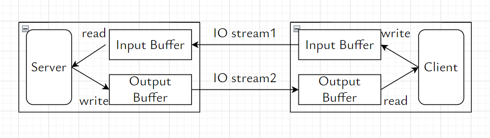

# ch07 套接字断开连接

## cc


双向 IO 流

- 调用 shutdown 函数，断开单向 IO 流
- 断开输出流时, 向对端发送 EOF

```c++
#include <sys/socket.h>
/**
 * @param socketFd 待断开套接字文件描述符
 * @param howto 断开方式
 * @return 成功时返回 0, 失败时返回 -1
 */
int shutdown(int socketFd, int howto);
```

| howto     |                                   |
| --------- | --------------------------------- |
| SHUT_RD   | 断开输入流, 不能向套接字中读数据  |
| SHUT_WR   | 断开输出流, 不能从套接字中写数据  |
| SHUT_RDWR | 同时断开输入/输出流，不能读写数据 |

## test

```shell
cd build
./ch07_file_server 3333
./ch07_file_client 127.0.0.1 3333

cd build/go
./ch07_file_server :3333
./ch07_file_client 127.0.0.1:3333
```
