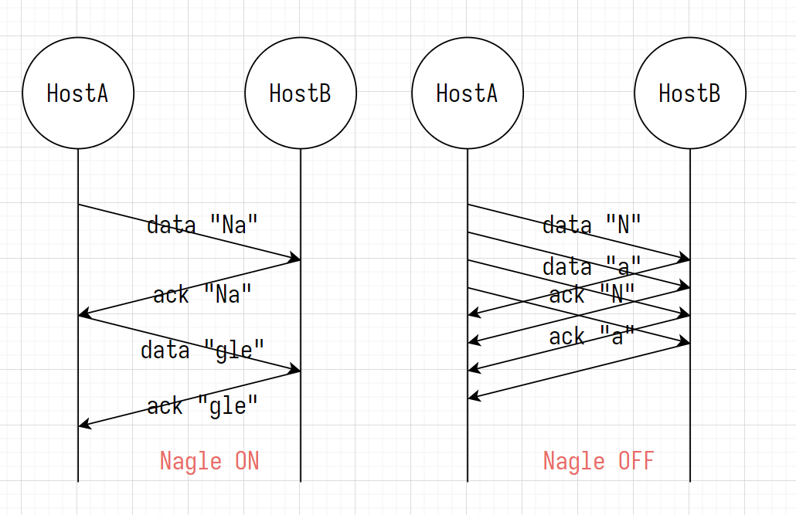

# ch09 套接字的选项

| 协议层 level | 选项名 optName    | 可读 | 可写 |
| ------------ | ----------------- | ---- | ---- |
| SOL_SOCKET   | SO_SNDBUF         | √    | √    |
| SOL_SOCKET   | SO_RCVBUF         | √    | √    |
| SOL_SOCKET   | SO_REUSEADDR      | √    | √    |
| SOL_SOCKET   | SO_KEEPALIVE      | √    | √    |
| SOL_SOCKET   | SO_BROADCAST      | √    | √    |
| SOL_SOCKET   | SO_DONTROUTE      | √    | √    |
| SOL_SOCKET   | SO_OOBINLINE      | √    | √    |
| SOL_SOCKET   | SO_ERROR          | √    | ×    |
| SOL_SOCKET   | SO_TYPE           | √    | ×    |
| IPPROTO_IP   | IP_TOS            | √    | √    |
| IPPROTO_IP   | IP_TTL            | √    | √    |
| IPPROTO_IP   | IP_MULTICAST_TTL  | √    | √    |
| IPPROTO_IP   | IP_MULTICAST_LOOP | √    | √    |
| IPPROTO_IP   | IP_MULTICAST_IF   | √    | √    |
| IPPROTO_TCP  | TCP_KEEPALIVE     | √    | √    |
| IPPROTO_TCP  | TCP_NODELAY       | √    | √    |
| IPPROTO_TCP  | TCP_MAXSEG        | √    | √    |

- SOL_SOCKET 层 套接字的通用选项
- IPPROTO_IP 层 IP 协议的选项
- IPPROTO_TCP 层 TCP 协议的选项

## cc

### getsockopt 和 setsockopt

```c++
#include <sys/socket.h>
/**
 * @param socketFd 套接字文件描述符
 * @param level 协议层
 * @param optName 选项名
 * @param optVal 接收选项值
 * @param optLen 接收选项长度
 * @return 成功时返回 0, 失败时返回 -1
 */
int getsockopt(int socketFd, int level, int optName, void *optVal, socklen_t *optLen);

/**
 * @param socketFd 套接字文件描述符
 * @param level 协议层
 * @param optName 选项名
 * @param optVal 接收选项值
 * @param optLen 接收选项长度
 * @return 成功时返回 0, 失败时返回 -1
 */
int setsockopt(int socketFd, int level, int optName, const void *optVal, socklen_t optLen);
```

### SO_SNDBUF 和 SO_RCVBUF

- SO_SNDBUF 发送缓冲区大小
- SO_RCVBUF 接收缓冲区大小

### SO_REUSEADDR 地址可重用

[客户端](../ch04/echo_client.cc)输入 CTRL+C 强制关闭时, 向[服务器](../ch04/echo_server.cc)发送 FIN, 四次挥手后断开连接,
客户端可以正常重启

[服务器](../ch04/echo_server.cc)输入 CTRL+C 强制关闭时, 重新绑定端口号 3333 启动服务器时, 会抛出 "Error bound IP addr
and port: Address already in use" 异常

[地址可重用的服务器](./reuseaddr_server.cc) 不会抛出异常

### 禁用 Nagle 算法

Nagle 算法: 收到上一个数据包的 ACK 时, 才发送下一个数据包



c++ 禁用 Nagle 算法

```c++
int optVal = 1; // 禁用 Nagle 算法
socklen_t optLen = sizeof(optVal);
setsockopt(socketFd, IPPROTO_TCP, TCP_NODELAY, &optVal/* 0 启用, 1 禁用 */, optLen);
```

go 禁用 Nagle 算法

```go
conn.SetNoDelay(true); // 禁用 Nagle 算法
```

查询是否禁用 Nagle 算法

```c++
int optVal;
socklen_t optLen = sizeof(optVal);
getsockopt(socketFd, IPPROTO_TCP, TCP_NODELAY, &optVal/* 0 启用, 1 禁用 */, &optLen);
```

## test

```shell
cd build
./ch09_test_sockopt
./ch09_reuseaddr_server 3333
./ch04_echo_client 127.0.0.1 3333
```
