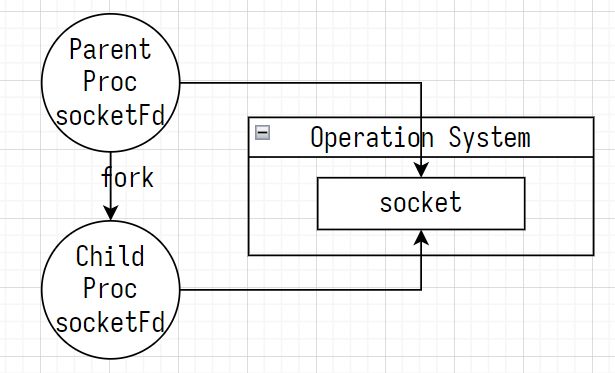

# ch10 多线程服务器

向多个客户端提供服务的并发服务器

- 多进程服务器
- IO 多路复用服务器
- 多线程服务器

进程 ID

```shell
ps au # 打印运行进程
```

- USER：User 启动进程的用户
- PID：Process ID 进程 ID
- %CPU：Percentage of CPU usage 进程的 CPU 占用率
- %MEM：Percentage of memory usage 进程的内存占用率
- VSZ：Virtual memory size 进程的虚拟内存大小，单位 KB
- RSS：Resident set size 进程的常驻内存大小，单位 KB
- TTY：Teletype 终端名，TTY = ? 表示进程与终端无关
- STAT：Process status 进程状态
  - R：运行状态 Running
  - S：睡眠状态 Sleeping
  - D：不可中断的睡眠状态 Disk Sleep
  - T：终止状态 Terminated
  - Z：僵尸进程 Zombie
- START：Start time 进程的启动时间
- TIME：CPU time 进程的 CPU 占用时间
- COMMAND：启动进程的命令

## cc

### 1 调用 fork 函数创建子进程

```c++
#include <unistd.h>
// 成功时返回子进程 pid, 失败时返回 -1
pid_t fork(void);
```

fork 函数复制父进程，创建子进程。父进程调用 fork 函数返回子进程的 pid，子进程调用 fork 函数返回 0

### 2 僵尸进程

子进程先于父进程终止，父进程未释放子进程的资源，子进程成为僵尸进程

#### 2.1 僵尸进程

[zombie.cc](./zombie.cc)

#### 2.2 调用 wait 函数预防僵尸进程

- 调用 wait 函数，父进程阻塞等待任一子进程终止
- WIFEXITED 子进程正常终止时返回 true，否则返回 false
- WEXITSTATUS 获取子进程的返回值 return ?; 或 exit(?);

```c++
#include <sys/wait.h>
/**
 * @param status 接收子进程的运行状态
 * @return 成功时返回终止的子进程 pid，失败时返回 -1
 */
pid_t wait(int *status);
```

#### 2.3 调用 waitpid 函数预防僵尸进程

- 调用 wait 函数，父进程会阻塞任一子进程终止
- 调用 waitpid 函数，父进程不会阻塞

```c++
#include <sys/wait.h>
/**
 * @param pid 等待终止的子进程 pid；传递 -1 表示等待任一子进程终止
 * @param status 接收子进程的运行状态
 * @param options 可以传递头文件 sys/wait.h 声明的常量 WNOHANG，表示没有子进程终止时，父进程不会阻塞
 * @return 成功时返回终止的子进程 pid，失败时返回 -1
 */
pid_t waitpid(pid_t pid, int *status, int options) // status 接收子进程的运行状态
```

### 3 信号处理

预备知识：调用 alarm 函数注册 timeout 时间

```c++
#include <unistd.h>
// 返回 timeout 时间
unsigned int alarm(unsigned int seconds);
```

#### 3.1 调用 signal 函数进行信号处理

调用 signal 函数注册信号 sig 和 信号处理函数 callback

```c++
#include <signal.h> // deprecated
using Callback = void (*)(int);
/**
 * @param sig 信号
 * @param callback 信号处理函数
 */
void signal(int sig, Callback callback);
```

```c++
Callback childExitCallback, timeoutCallback, keyboardCallback;

signal(SIGCHLD/* 子进程终止 */, childExitCallback);
signal(SIGALRM/* alarm 函数注册的 timeout 时间到 */, timeoutCallback);
signal(SIGINT/* 用户输入 CTRL+C */, keyboardCallback);
```

#### 3.2 调用 sigaction 函数进行信号处理（推荐）

信号处理器：sigaction 结构体

```c++
using Callback = void (*)(int);
struct sigaction {
  Callback sa_handler; // 信号处理函数
  sigset_t sa_mask;    // 置 0
  int sa_flags;        // 置 0
}
```

调用 sigaction 函数，注册信号 sig 和信号处理器 sigAct

```c++
#include <signal.h>
/**
 * @param sig 信号
 * @param sigAct 信号处理器
 * @param oldSigAct 接收已注册的信号处理器，不需要则传递 0
 * @return 成功时返回 0，失败时返回 -1
 */
int sigaction(int sig, const struct sigaction *sigAct, struct sigaction *oldSigAct);
```

#### 3.3 通过信号处理预防僵尸进程

[kill_zombie.cc](./kill_zombie.cc)

### 4 多进程服务器

[multi-proc_server](./multi-proc_server.cc)

#### 4.1 父进程通过 fork 函数将文件描述符复制给子进程

1. [multi-proc_server](./multi-proc_server.cc)中，父进程通过 fork 函数将 2 个文件描述符 serverSocketFd 和 socketFd 复制给子进程
2. 套接字 socket、管道 pipe 是操作系统资源，文件描述符 fd 是进程资源
3. 一个套接字有多个文件描述符时，销毁所有文件描述符后，才能销毁套接字



### 5 分割数据收发的多进程客户端

分割数据收发：父进程负责接收数据，子进程负责发送数据

[multo-proc_client](./multi-proc_client.cc)

## go

go 语言没有进程、线程，只有 goroutine（有栈协程）

- 进程：资源分配单位
- 线程：处理机调度单位
- 协程：轻量的用户态线程

exec.Cmd 用于封装命令

```go
package exec

type Cmd struct {
    Path string      // 命令路径，非空
    Args []string    // 命令参数
    Env []string     // 进程的环境变量
    Dir string       // 进程的工作目录
    Stdin io.Reader  // 进程的标准输入
    Stdout io.Writer // 进程的标准输出
    Stderr io.Writer // 进程的标准错误输出
    /* ... */
}
```

通过 exec.Command 函数生成 exec.Command 实例

```go
func Command(name string, arg ...string) *Cmd
```

命令的执行

1. 只执行命令，不获取结果
2. 执行命令并获取结果，不区分 stdout 和 stderr
3. 执行命令并获取结果，区分 stdout 和 stderr

[test_cmd.go](./go/test_cmd.go)

## test

```shell
cd build
./ch10_test_fork
./ch10_zombie &
ps au
#  COMMAND
#  ./ch10_zombie # 父进程
#  [ch10_zombie] <defunct> # 子进程、僵尸进程

./ch10_test_waitpid
./ch10_test_signal
./ch10_test_sigaction
./ch10_proc_server 3333
./ch10_proc_client 127.0.0.1 3333
./ch10_proc_client 127.0.0.1 3333
./ch10_proc_client 127.0.0.1 3333

cd build/go
./ch10_test_cmd
```
