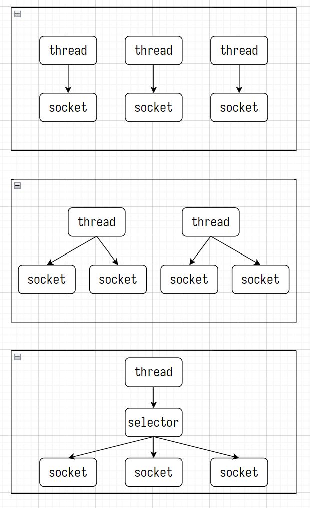

# ch12 IO 复用



## select 函数

设置文件描述符

| 文件描述符 | 值  | 说明            |
| ---------- | --- | --------------- |
| fd0        | 0   | 标准输入 stdin  |
| fd1        | 1   | 标准输出 stdout |
| fd2        | 2   | 标准错误 stderr |

```c++
fd_set fdSet; // 0 不监听，1 监听

FD_ZERO(fd_set *fdSet); // fdSet 置 0，不监听所有的文件描述符
FD_ZERO(&fdSet);
//   fd0   fd1   fd2
// *-----*-----*-----*----
// |  0  |  0  |  0  | ...
// *-----*-----*-----*----

FD_SET(int fdx, &fdSet); // fdx 置 1，监听 fdx
FD_SET(1, &fdSet); // 监听标准输出 stdout
//   fd0   fd1   fd2
// *-----*-----*-----*----
// |  0  |  1  |  0  | ...
// *-----*-----*-----*----

FD_CLR(int fdx, &fdSet); // fdx 置 0，不监听 fdx
FD_CLR(2, &fdSet); // 不监听标准输出 stdout
//   fd0   fd1   fd2
// *-----*-----*-----*----
// |  0  |  0  |  0  | ...
// *-----*-----*-----*----

// select 函数的返回值 > 0，即有 fd 可读/可写时，返回 fdx 是否可读/可写
FD_ISSET(int fdx, fd_set* fdSet);
```

设置监听范围和超时

```c++
#include <sys/select.h>
#include <sys/time.h>

/**
 * @param numFd - fd_set 的最大 fd 值 +1
 * @param readFdSet - &fd_set 监听是否可读，NULL 表示不监听
 * @param writeFdSet - &fd_set 监听是否可写，NULL 表示不监听
 * @param exceptFdSet - &fd_set 监听有无异常，NULL 表示不监听
 * @param timeout 超时
 * @return 有 fd 可读/写时，返回 IO 就绪的 fd 数量；有异常返回 -1；超时返回 0
 */
int select(int numFd, fd_set *readFdSet, fd_set *writeFdSet, fd_set *exceptFdSet, const struct timeval *timeout);
```

```c++
struct timeval {
    long tv_sec; // 秒
    long tv_usec; // 毫秒
}
```

## test

```shell
./ch12_select_server 3333
./ch10_multi-proc_client 127.0.0.1 3333
```
