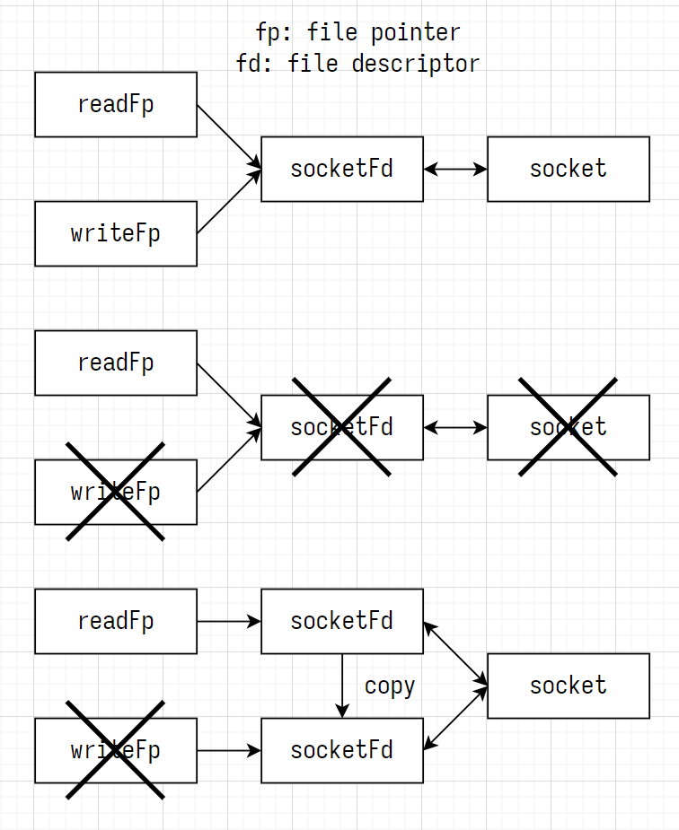

# ch16 分离 IO 流

## cc

### 分离 IO 流的方法

1. ch10 调用 fork 函数复制父进程，创建子进程。父进程负责接收数据，子进程负责发送数据
2. ch15 调用 fdopen 函数，将文件描述符转换为 2 个 FILE 结构体指针：读模式指针 readFp 和写模式指针 writeFp

### 复制文件描述符

调用 dup 或 dup2 函数，复制文件描述符



1. 文件读、写指针使用相同文件描述符创建，关闭任一文件指针时，都会断开双向 IO 流
2. 调用 dup 或 dup2 函数，复制文件描述符
3. 文件读、写指针使用不同文件描述符创建，关闭所有文件指针时，才会断开双向 IO 流

```c++
#include <unistd.h>
/**
 * @param fd 文件描述符
 * @param duplicateFd 指定复制的 fd 值
 * @return 成功时返回复制的 fd 值，失败时返回 -1
 */
int dup(int fd);
int dup(int fd, int duplicateFd);
```

### 复制 fd 并分离 IO 流

复制 fd，使用不同的 fd 创建文件读/写指针，分离 IO 流

[sep_server](./sep_server.cc)

```c++
//! 复制 fd
int dupClientSocketFd = dup(clientSocketFd);
//! 分离 IO 流
FILE *readFp = fdopen(clientSocketFd, "r");     //* 文件读指针
FILE *writeFp = fdopen(dupClientSocketFd, "w"); //* 文件写指针

/* 服务器向 socket 中写数据 */

//! 断开输出流，仍可以从套接字中读数据
shutdown(fileno(writeFp), SHUT_WR);
//! 文件读、写指针使用不同文件描述符创建，关闭所有文件指针时，才会断开双向 IO 流
fclose(writeFp);

/* 服务器从 socket 中读数据  */

//! 断开输入流，所有文件指针已关闭，断开 socket 连接
fclose(readFp);
```

## go

ch15

- 调用 os.NewFile 函数，将文件描述符 fd 转换为 os.File 结构体指针 fp
- 调用 fp.Fd 方法，将 os.File 结构体指针 fp 转换为文件描述符 fd

### 复制文件描述符

调用 syscall.Dup 或 syscall.Dup2 函数，复制文件描述符

```go
import "syscall"

func syscall.Dup(fd int) (dupFd, err error)
func syscall.Dup2(fd, dupFd int) (err error)
```

[sep_server](go/server2/server2.go)

```go
tcpConn, _ := conn.(*net.TCPConn) // 类型断言
readFp, _ := tcpConn.File()       //! 获取 TCP 连接对应的 os.File 结构体指针 readFp，负责读数据
fd := readFp.Fd()                 //! 将 os.File 结构体指针 readFp 转换为文件描述符 fd

//! 复制 fd
dupFd, _ := syscall.Dup(int(fd))
//! 分离 IO 流
writeFp := os.NewFile(uintptr(dupFd), "") //* 使用复制的 fd 创建 os.File 结构体指针 writeFp，负责写数据
reader := bufio.NewReader(readFp)         // 分配服务器读缓冲
writer := bufio.NewWriter(writeFp)        // 分配服务器写缓冲

// 调用 writeFp.Write 方法，向 socket 中写数据

//! 断开输出流，仍可以从套接字中读数据
C.shutdown(C.int(dupFd), C.SHUT_WR)
//! 文件读、写指针使用不同文件描述符创建，关闭所有文件指针时，才会断开双向 IO 流
writeFp.Close()

// 调用 writeFp.Read 方法，从 socket 中读数据

//! 断开输入流，所有文件指针已关闭，断开 socket 连接
readFp.Close()
//! 断开 socket 连接
conn.Close()
```

## test

```shell
cd build
./ch16_server1 3333
./ch16_client 127.0.0.1 3333

./ch16_test_dup

./ch16_server2 3333
./ch16_client 127.0.0.1 3333

cd build/go
./ch16_server1 :3333
./ch16_client 127.0.0.1:3333

./ch16_server2 :3333
./ch16_client 127.0.0.1:3333
```
