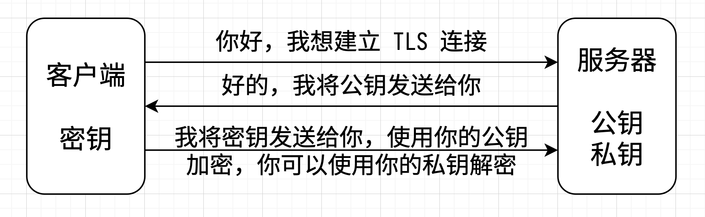

# 9/10 组会

## HTTP

```shell
GET / HTTP/1.1\r\n # 请求行
# 请求头
Host: httpbin.org\r\n
Connection: keep-alive\r\n
Upgrade-Insecure-Requests: 1\r\n
User-Agent: Mozilla/5.0 (Macintosh; Intel Mac OS X 10_15_7) AppleWebKit/537.36 (KHTML, like Gecko) Chrome/128.0.0.0 Safari/537.36\r\n
Accept: text/html,application/xhtml+xml,application/xml;q=0.9,image/avif,image/webp,image/apng,*/*;q=0.8,application/signed-exchange;v=b3;q=0.7\r\n
Accept-Encoding: gzip, deflate\r\n
Accept-Language: zh-CN,zh;q=0.9,en-US;q=0.8,en;q=0.7\r\n
```

| 请求行   | 描述          |
| -------- | ------------- |
| GET      | 请求方法      |
| /        | 请求路径      |
| HTTP/1.1 | HTTP 协议版本 |

```shell
HTTP/1.1 200 OK\r\n # 响应头
# 响应体
Date: Tue, 10 Sep 2024 02:44:10 GMT\r\n
Content-Type: application/json\r\n
Content-Length: 41019\r\n
Connection: keep-alive\r\n
Server: gunicorn/19.9.0\r\n
Access-Control-Allow-Origin: *\r\n
Access-Control-Allow-Credentials: true\r\n
```

## HTTP + SSL = HTTPS

### 对称加密

- 公钥，例如 `$HOME/.ssh/id_rsa.pub`
- 私钥，例如 `$HOME/.ssh/id_rsa`
- 使用公钥加密的数据，必须使用私钥解密
- 使用私钥加密的数据，必须使用公钥解密

建立 TLS 连接

- SSL, Secure Sockets Layer
- TLS, Transport Layer Security



### 中间人攻击

例

Alice 期望与 Bob 通信
